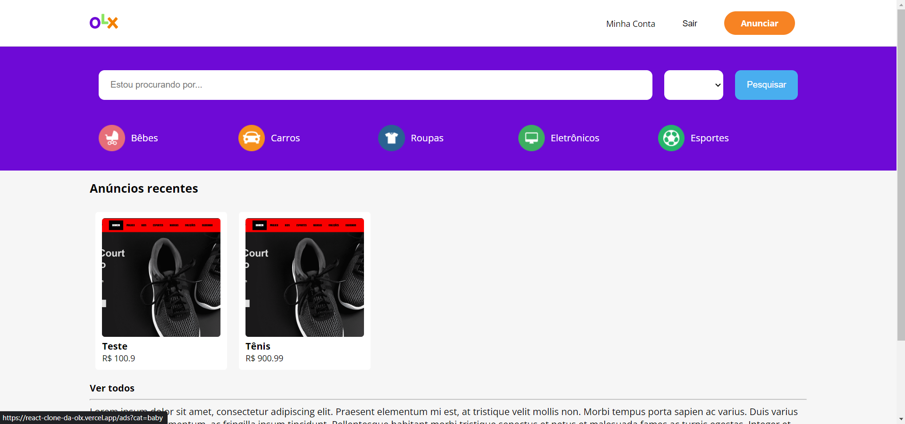

# Clone da OLX

<h4 align='center'>Projeto mais completo até agora com direito a próprio back-end em Nodejs e diversas outras funcionalidades, feito durante o curso de React da <a href="https://b7web.com.br/fullstack/?ref=I24108426I&gclid=CjwKCAjw7cGUBhA9EiwArBAvog9V2u1XVk1CgL7W_bHZl67ys9p6bTy_bw-kusqWhM6TWdrs7HrMuBoCVkkQAvD_BwE" target="_blank" >B7web</a></h4>

<p align='center'>
    <a href="#tecnologias">Tecnologias</a>&nbsp;&nbsp;&nbsp;|&nbsp;&nbsp;
    <a href="#como-usar">Como usar</a>
</p>



<h1 align='center'>
    <a href="https://react-clone-da-olx.vercel.app/">Clique aqui para Testar o app</a>
</h1>

# Tecnologias

As seguintes tecnologias foram usadas:

- React
- Node [API](https://github.com/willianduartte/Node-olx-api)
- amazon web services (aws) S3
- Javascript
- HTML5
- Styled Components (CSS)
- React router
- Redux
- js Cookies

# Como usar

Para clonar e rodar essa aplicação você precisa ter o [Git](https://git-scm.com/) e o [Node.js](https://nodejs.org/en/) instalado no seu computador e rodar os seguntes codigos no seu CDM (Prompt de comando)

```bash
# Clonar o repositorio
$ git Clone https://github.com/willianduartte/React-OLX-Clone

# com o repositorio selecionado no seu CDM rode
$ npm install

# Rode o app
$ npm start
```

Feito com <3 por [Willian Duarte](https://www.linkedin.com/in/willian-duarte-de-souza-4321a6230/)
